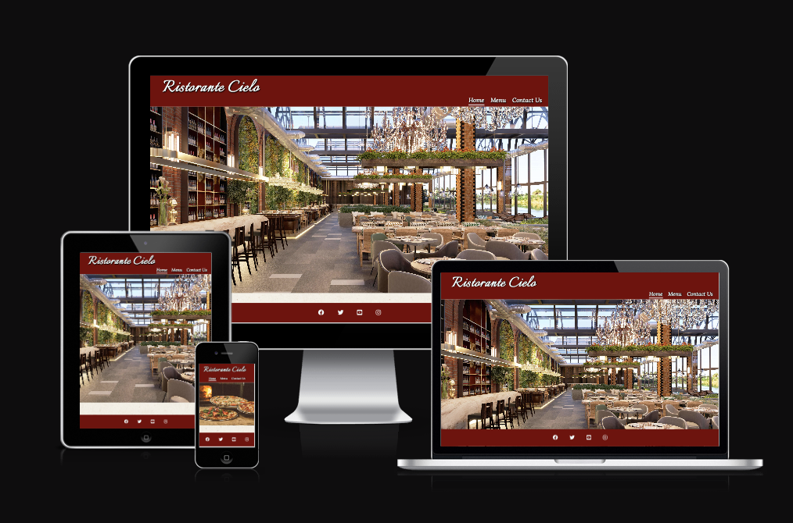
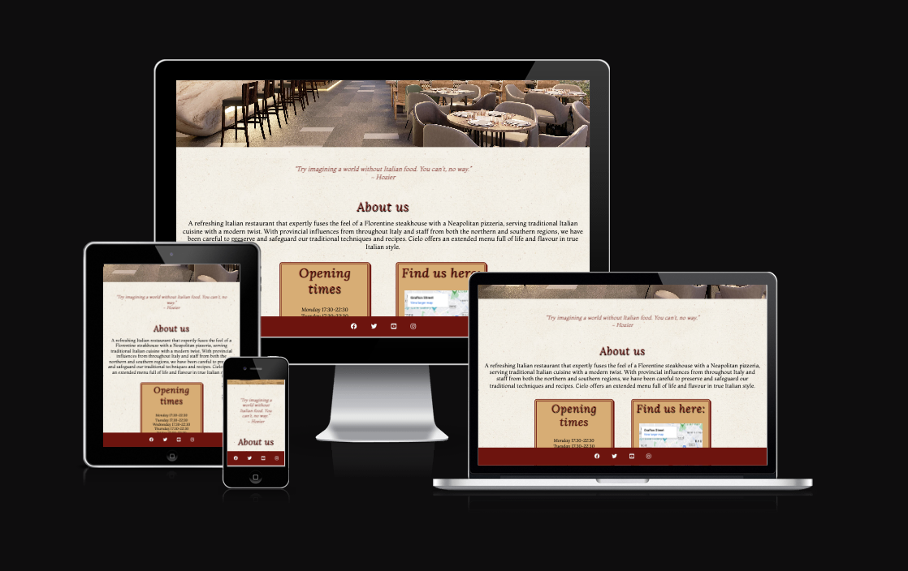

# Ristorante Cielo

## About

This is a website for [Ristorante Cielo](https://rachelconlon.github.io/Ristorante-Cielo/index.html), an Italian restaurant... Brief introduction that outlines the site purpose and who it is for

## Am I responsive?

Screenshot using website that shows hoe the site will look on differernt devices types and sizes.

## Features 
-----

Include description and screenshots of each

* ### Navigation
    * 
* ### The Header

* ### The About Us Section

* ### Opening Hours

* ### Find Us Here

* ### The Menu Page

* ### The Contact Us page

* ### The Footer

## Testing
-----
### Manual Testing
* Tested browsers
* Confirm responsiveness
* Confirm navigation options all work
* Confirm the 'Make a Reservation' buttom under 'Opening Hours' brings the visitor to the Home page
* Confirm that the Form work and the inout rules are all working
### Bugs
* #### Solved bugs
* #### Unfixed bugs

### Validator Testing
* #### HTML
* #### CSS
* #### Accessibility

## Deployment
-----
 + The site was delpoyed using GitHub Pages:
     * In the relevant GiHub repository, click on the Settings tab
     * Navigate to the Pages section
     * Under 'Build and deployment' select the Main branch
     * Click 'Save'
     * A link will then be provided for your live site

## Credits
-----

### Content
 * The code to create the social media links in the footer was taken from the Code Institute Love Running Project
 * The text in the About Us section was adapted from these websites:
    * https://www.basta-dubai.com/
    * https://rossini.ie
* The fonts used were taken from [Google Fonts](https://fonts.google.com/)

### Media
* The images used throughout the site were taken from [Pexels](https://www.pexels.com/)