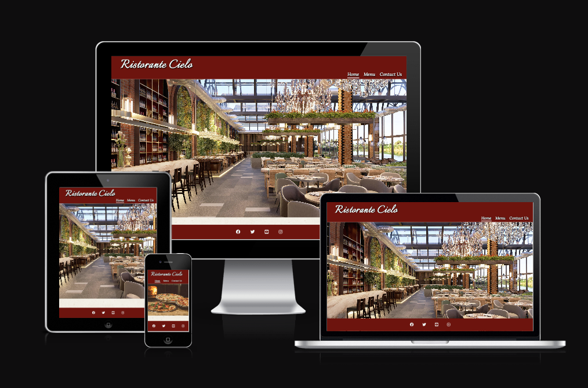
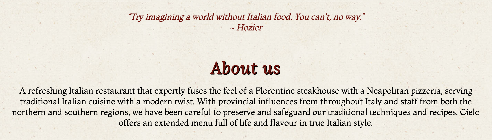

# Ristorante Cielo

This is a website for and Italian restaurant called, [Ristorante Cielo](https://rachelconlon.github.io/Ristorante-Cielo/index.html). Users of this website will be able to find relavent information about the restaurant, along with contact details. 

The website allows the user to view the menu options in advance and also make a reservation directly from the website. This site is targeted towards potential customers of the restaurant.

## Features 
-----

* ### Navigation and Header
    * This is located in the header at the top of each page of the website. On the left side of the navigation bar the logo, which is the restaurant name, is shown. By clicking this the user will always be brought to the 'Home' page.
    * Other navigation options are found on the right side of the bar. These links allow the user to navigate to the Menu page, the Contact options or back to the Home page once again.
    * The navigation clearly tells the user the name of the restaurant and the different sections of the site that are available so they can efficiaently find the information they require.
    * The navigation bar colour contrast effectively with the hero image directly below, which illustrates the inside of the restaurant.

* ### The About Us Section
    * The About Us section provides details about the restaurant and staff to the user.
    * From this section the user will also get a feel for the traditional cuisine available.

* ### Opening Hours

* ### Find Us Here

* ### The Menu Page

* ### The Contact Us page

* ### The Footer

## Testing
-----
### Manual Testing
* Tested browsers
* Confirm responsiveness
* Confirm navigation options all work
* Confirm the 'Make a Reservation' buttom under 'Opening Hours' brings the visitor to the Home page
* Confirm that the Form work and the inout rules are all working
### Bugs
* #### Solved bugs
* #### Unfixed bugs

### Validator Testing
* #### HTML
* #### CSS
* #### Accessibility

## Deployment
-----
 + The site was delpoyed using GitHub Pages:
     * In the relevant GiHub repository, click on the Settings tab
     * Navigate to the Pages section
     * Under 'Build and deployment' select the Main branch
     * Click 'Save'
     * A link will then be provided for your live site

## Credits
-----

### Content
 * The code to create the social media links in the footer was taken from the Code Institute Love Running Project
 * The text in the About Us section was adapted from these websites:
    * https://www.basta-dubai.com/
    * https://rossini.ie
* The fonts used were taken from [Google Fonts](https://fonts.google.com/)

### Media
* The images used throughout the site were taken from [Pexels](https://www.pexels.com/)