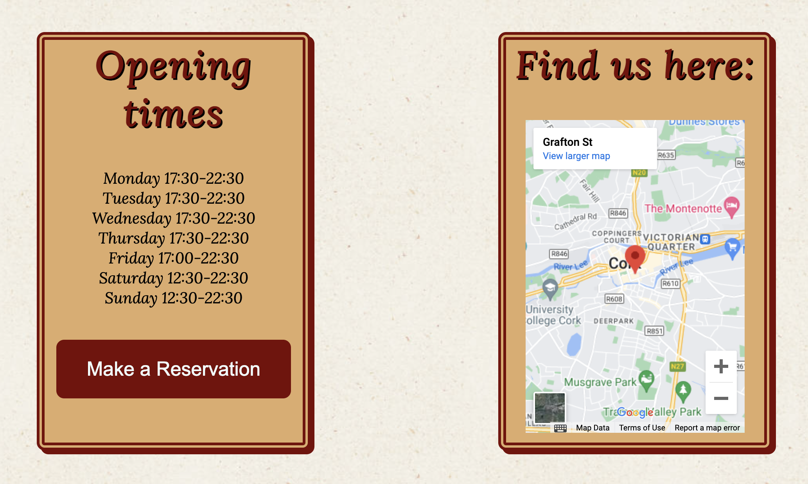
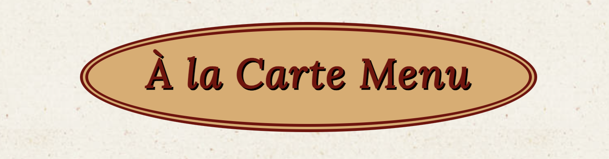
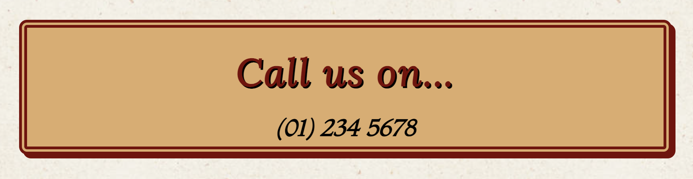
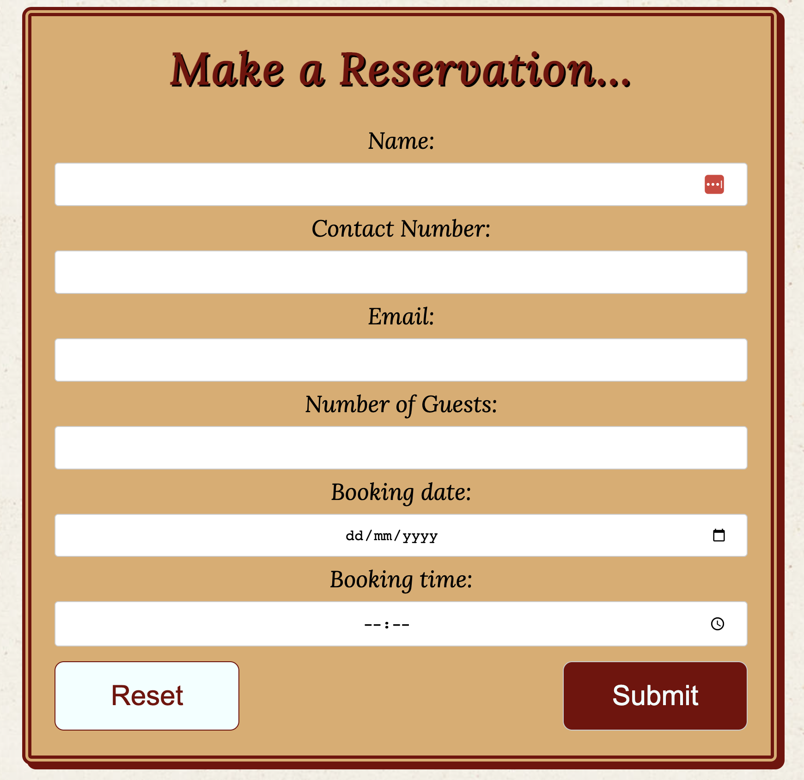
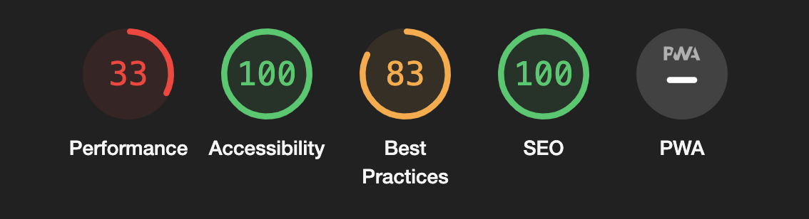

# Ristorante Cielo

This is a website for and Italian restaurant called, [Ristorante Cielo](https://rachelconlon.github.io/Ristorante-Cielo/index.html). Users of this website will be able to find relavent information about the restaurant, along with contact details. 

The website allows the user to view the menu options in advance and also make a reservation directly from the website. This site is targeted towards potential customers of the restaurant.

## Features 
-----

* ### Navigation and Header
    * This is located in the header at the top of each page of the website. On the left side of the navigation bar the logo, which is the restaurant name, is shown. By clicking this the user will always be brought to the 'Home' page.
    * Other navigation options are found on the right side of the bar. These links allow the user to navigate to the Menu page, the Contact options or back to the Home page once again.
    * The navigation clearly tells the user the name of the restaurant and the different sections of the site that are available so they can efficiaently find the information they require.
    * The navigation bar colour contrast effectively with the hero image directly below, which illustrates the inside of the restaurant.

* ### The About Us Section
    * The About Us section provides details about the restaurant and staff to the user.
    * From this section the user will also get a feel for the traditional cuisine available.

* ### Opening Hours and Find Us Here
    * This section provides more information for the user, regarding hours of operation and where the restaurant can be found.
    * The Opening Hours section provides both the opening and a 'Make a Reservation' link. This link brings the customer to the Contact Us page, where they find the contact number or the form to make a reservation.
    * The 'Find Us Here' section provides a Google Maps pin drop of the restaurants location.

* ### The Menu Page
    * This page allows the user to view the menu in advance.

* ### The Contact Us page
    * The 'Contact Us' page provide the user with two options.
    * The 'Call Us' section provides the contact number for the restaurant

    

    * The 'Make a Reservation' section give the user the option to complete a form to book a table.

    

* ### The Footer
    * The footer is simplistic and provides links to the social accounts for the restaurant.
    * Each link will open the social account in a new page.

    

## Testing
-----
### Manual Testing

* I tested to ensure this website worked in different browsers: Safari, Google Chrome and Mozilla Firefox
* I have confirmed that this site responsive and looks good on different browsers and devices.
* I have tested that all navigation options work and bring the user to the expected location.
* I have confirm the 'Make a Reservation' buttom under 'Opening Hours' brings the visitor to the 'Contact Us' page
* I have tested the form and confirmed that it works and the input rules are also working as specified.

### Bugs
    * No bugs were found

### Validator Testing
* #### HTML
    * The only errors found when passing through the official W3C validator were linked to the iframe for Google Maps in the 'Find Us Here' section.

* #### CSS
    * 1 parse error found when passing through the official (Jigsaw) validator. This was also link to Google Maps, as mentioned previously.

* #### Accessibility
    * I ran the site through Lighthouse in Chrome DevToolsand I can confirm that the colours and fonts used are easy to read and accessible by getting a score of 100.

* I need to continue working on the performance of the page.

## Deployment
-----
 + The site was delpoyed using GitHub Pages:
     * In the relevant GiHub repository, click on the Settings tab
     * Navigate to the Pages section
     * Under 'Build and deployment' select the Main branch
     * Click 'Save'
     * A link will then be provided for your live site

## Credits
-----

### Content
 * The code to create the social media links in the footer was taken from the Code Institute Love Running Project
 * The text in the About Us section was adapted from these websites:
    * https://www.basta-dubai.com/
    * https://rossini.ie
* The fonts used were taken from [Google Fonts](https://fonts.google.com/)

### Media
* The images used throughout the site were taken from [Pexels](https://www.pexels.com/)